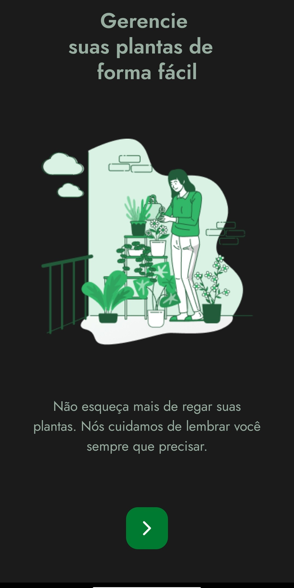

<h1 align="center"> PlantManager</h1>

Projeto feito na NLW# 5 programa exclusivo e gratuito promovido pela Rocketseat para ensino de tecnologias Mobile.

  <a href="#-tecnologias">Tecnologias</a>&nbsp;&nbsp;&nbsp;|&nbsp;&nbsp;&nbsp;
  <a href="#-projeto">Projeto</a>&nbsp;&nbsp;&nbsp;|&nbsp;&nbsp;&nbsp;
  <a href="#memo-licença">Licença</a>

  

 

  

## 🚀 Tecnologias

Esse projeto foi desenvolvido com as seguintes tecnologias:

- TypeScript
- React Native
- Expo
- Git e Github
- Figma

## 💻 Projeto

O PlantManager é um aplicativo onde é armazenado informações sobre as suas plantas que você possue em sua residência ou escritório, através de notificações ele te lembra de regá-las.

## :memo: Licença

Esse projeto está sob a licença MIT.

---

Feito com ♥ by Rocketseat :wave: [Participe da nossa comunidade!](https://discord.gg/rocketseat)
